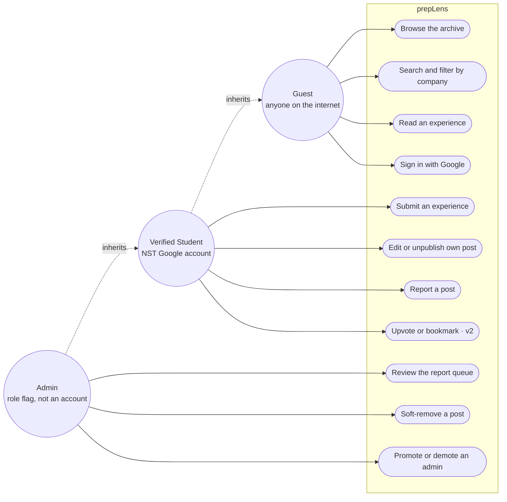
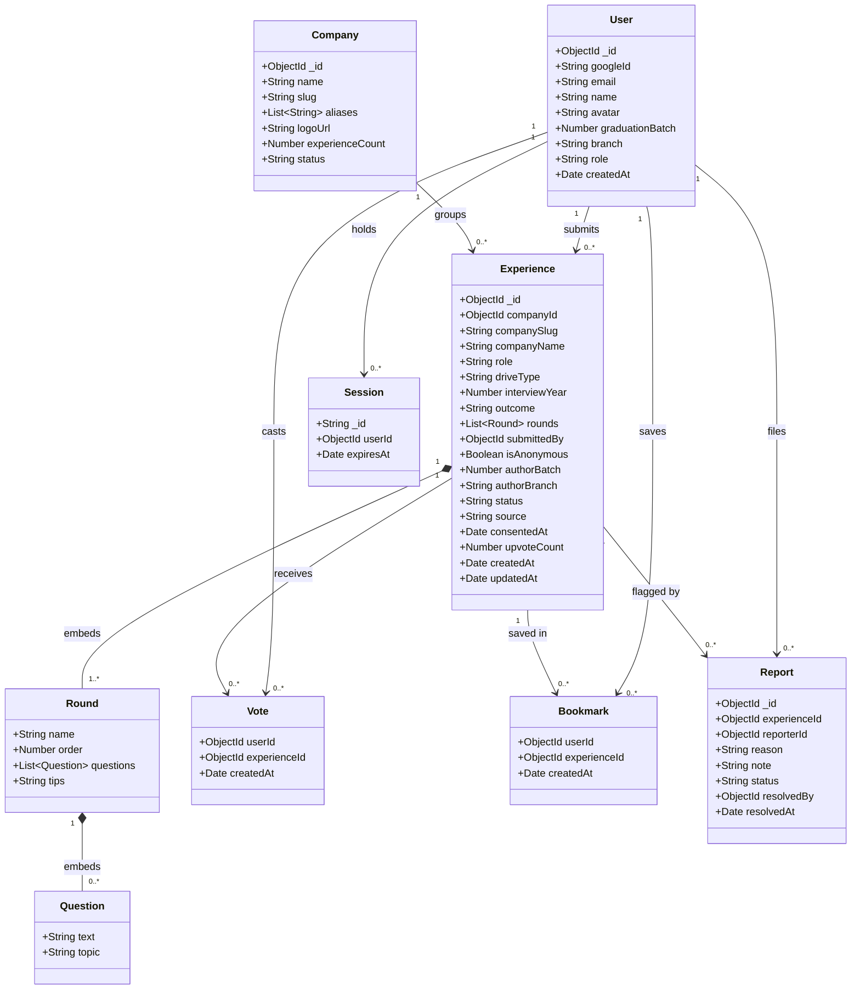
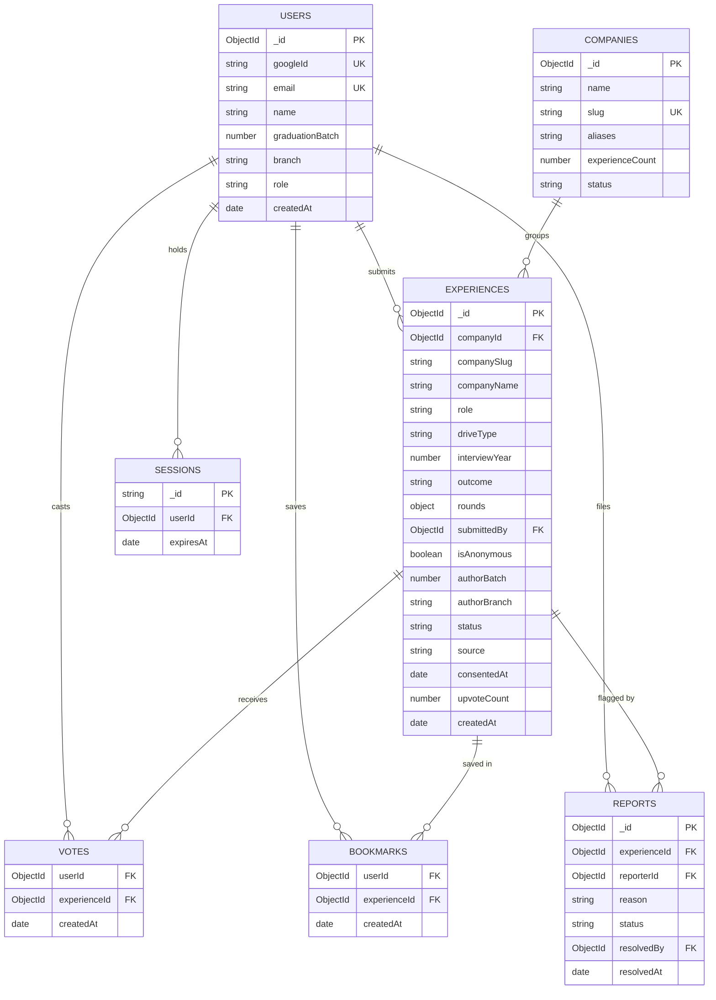
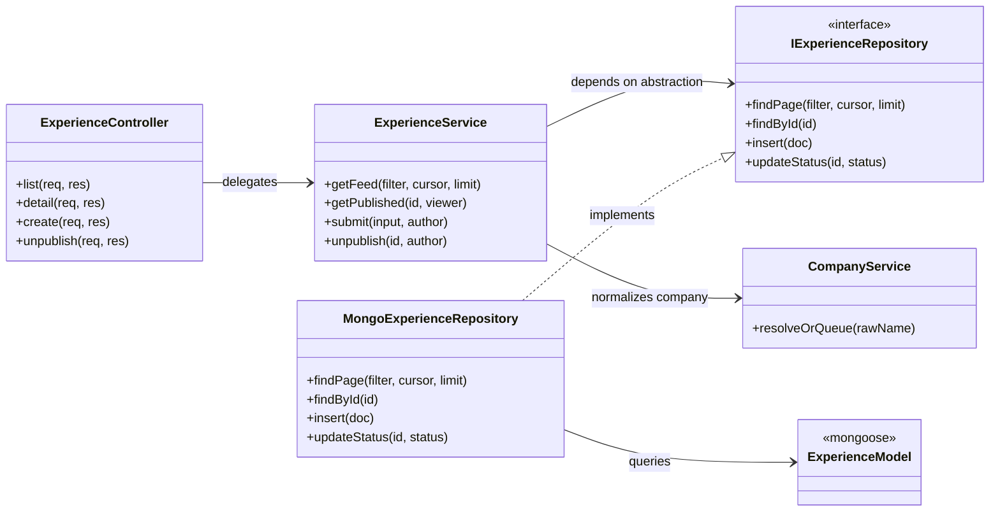
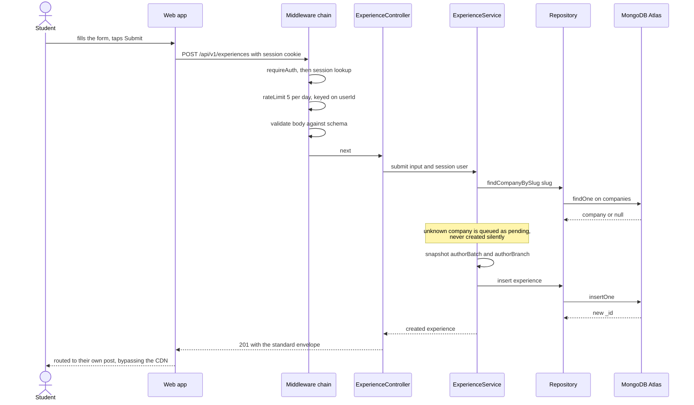
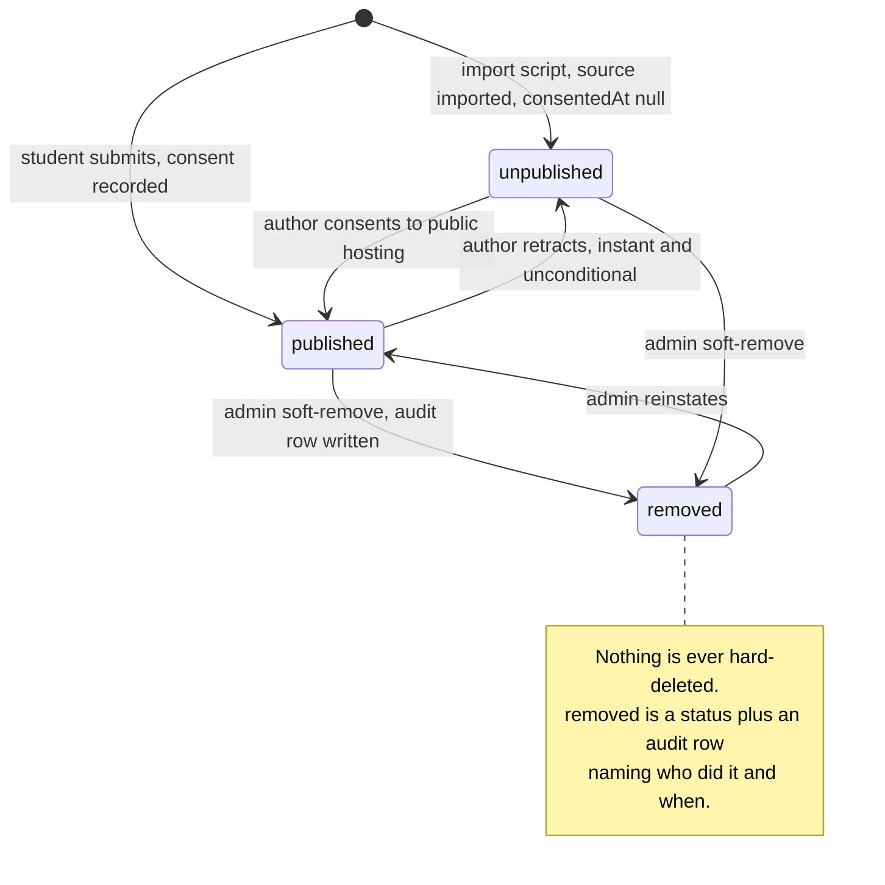
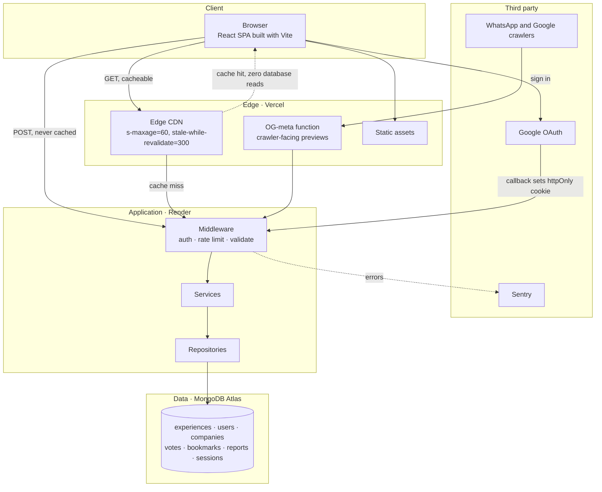

# prepLens

**A community-curated archive of campus placement interview experiences — written by seniors, for juniors.**

_Every interview, every round, every question._

---

## The problem

Interview experiences at NST are scattered across WhatsApp groups and word of mouth. A junior with a Deloitte interview in nine days has no way to find out what round two actually asks, from someone who sat in it.

## The job to be done

> A 2028-batch student has a Deloitte interview in nine days and wants to know what round two actually asks, from someone who sat in it.

That sentence is the whole product. Every feature either shortens the path from _"I have an interview"_ to _"I know what's coming"_, or it is decoration.

### Anti-goals

- **Not a job board** — it never tells you a company is hiring.
- **Not a DSA practice site** — it records the question that was asked; LeetCode solves it.
- **Not a discussion forum** — no threads, no replies.
- **Not a résumé review or referral network** — different products, different trust models.

---

## Status

**Phase 1 in progress — Block 0 done.** The architecture was designed first, on purpose; it is now being built block by block, and no block is finished until its criteria are measured rather than assumed.

| | |
|---|---|
| Owner | Ravi Yadav — NST, Rishihood University, batch 2027 |
| Design record | [`docs/ARCHITECTURE.md`](docs/ARCHITECTURE.md) — how it is built |
| Specification | [`docs/SPEC.md`](docs/SPEC.md) — what it does, with acceptance criteria |
| Delivery plan | [`docs/PLAN.md`](docs/PLAN.md) — sequence, effort and risk |
| Pace | Depth over speed |
| Doubles as | System Design coursework |

### Phases

| Phase | Goal | Ships when |
|---|---|---|
| **1 · Launch the archive** | A junior can find and read real experiences; a senior can add one in under two minutes | A junior finds a relevant experience without asking for the link |
| **2 · Engagement and signal** | The archive shows which experiences are worth reading and which companies people need | Submissions continue without being individually chased |
| **3 · Intelligence** | The archive answers "how do I prepare for X", grounded in cited experiences | A generated guide contains no claim unsupported by a citation |

Phases are gated, not parallel — full reasoning and preconditions in [`docs/PLAN.md`](docs/PLAN.md).

---

## Decisions locked

| Decision | Choice | What it forces on the design |
|---|---|---|
| Anonymity | Optional, per post | Identity derived from `submittedBy`, never typed. Anonymous posts show batch only. |
| Read access | Public; NST account to post | Content is Google-indexable forever, so consent, retraction and CDN caching are all v1 concerns. |
| Frontend | Vite SPA + OG-meta function | No SSR. Link previews via one serverless function; Next.js migration deferred, not precluded. |
| Pace | Depth over speed | Every build block ends in something measured, not just something running. |
| Patterns | Layered; GoF where earned | Controller/Service/Repository is real. Singleton and Factory are implemented and honestly labelled. |

---

## Tech stack

**Frontend** — React (Vite), Tailwind CSS, React Router, Axios, Context API
**Backend** — Node.js, Express, Passport (Google OAuth), opaque server sessions, zod/express-validator, express-rate-limit, pino
**Database** — MongoDB Atlas + Mongoose
**Deployment** — Vercel (web) · Render (API) · MongoDB Atlas (data)

---

## System design — UML

All diagrams below are Mermaid, so GitHub renders them inline — no images to regenerate when the design changes. Edit the source, and the picture updates with it.

### 1 · Use case diagram

Who can do what. Actor generalization matters here: a verified student can do everything a guest can, and an admin everything a student can — which is exactly how the authorization middleware is layered.



### 2 · Domain class diagram

The LLD. Note the two different relationship types: **composition** (filled diamond, `*--`) for `Round` and `Question`, because they are embedded subdocuments with no independent existence, versus **association** (`-->`) for everything that is its own collection joined by id. That distinction *is* the embed-versus-reference decision, drawn.



### 3 · Entity relationship diagram

The same model at storage level, with crow's-foot cardinality. `VOTES` and `BOOKMARKS` are junction collections — the many-to-many between users and experiences is resolved into its own rows, each protected by a unique compound index.



### 4 · Backend layer class diagram

The layering, and the one arrow that carries the whole point: `ExperienceService` depends on the repository **interface**, and the Mongo implementation also points at that interface. Dependencies aim at the abstraction, not at Mongoose — which is why swapping the datastore or running a service test without a database is possible at all.



### 5 · Sequence diagram — submitting an experience

The full write path. Every guard runs before the controller is ever reached, and the author's identity is taken from the session rather than the request body.



### 6 · State machine — experience lifecycle

Why `status` is an enum and not a boolean, and why nothing is ever hard-deleted.



### 7 · Deployment and component diagram

The HLD. The asymmetry is deliberate: reads are public and cacheable, so most of them never reach the server at all; writes are authenticated and skip the edge entirely.



---

## Build order

Ten blocks. Do not start one before the previous block's **done when** is genuinely true.

| Block | Scope | Done when |
|---|---|---|
| 0 | Ground rules — env validation, logging, healthz, error envelope | Removing `JWT_SECRET` crashes with one readable line, not a stack trace |
| 1 | Data layer — schemas, every index, repositories, idempotent seed | Seed is idempotent and `.explain()` shows `IXSCAN` |
| 2 | Auth — Google OAuth, domain check, server sessions, cookies | A personal Gmail is refused with a real sentence; a logged-out session id is genuinely dead |
| 3 | Public read APIs — cursor pagination, filters, cache headers | Inserting a row mid-scroll leaves page 2 with no duplicate |
| 4 | Write APIs — submit, edit, retract, report, rate limits | "Google", "google " and "Google India" all resolve to `companySlug: google` |
| 5 | Fill the archive — inventory, consent, import | ≥ 25 experiences published with recorded consent, across ≥ 12 companies |
| 6 | Frontend foundation — feed, detail, filters, OG previews | A WhatsApp link shows a real preview with the company name |
| 7 | Submit flow + moderation — quick submit, consent line, admin queue | You can answer from the database alone who removed a post, and when |
| 8 | Launch — paid instance, domain, Sentry, tests | A junior finds a relevant experience without asking for the link |
| 9 | v2 — votes, bookmarks, company stats, request-an-experience | A double-tapped vote leaves the count at exactly 1 |

Full task lists, with the reasoning behind each, are in [`docs/ARCHITECTURE.md`](docs/ARCHITECTURE.md#11--build-order).

---

## Launch targets for v1

| Metric | Target | Why this number |
|---|---|---|
| Published experiences at launch | ≥ 25 | Below roughly twenty the archive reads as empty and nobody adds a twenty-sixth |
| Companies covered | ≥ 12 | Enough that most visitors find _their_ company |
| Time to first useful screen | < 5 s | Public read means no login wall — the feed must render in one hop |
| New submissions, first placement month | ≥ 10 | The only metric that proves this is a community archive and not a personal blog |

---

## Consent and content policy

prepLens hosts student-authored accounts of real interviews on the public internet. That carries obligations, and they are v1 requirements rather than nice-to-haves:

- **Explicit consent at submit time** — one unavoidable line above the button: _"This will be publicly visible on the internet, including to recruiters and search engines. You can unpublish it at any time."_
- **Anonymous means batch only** — `Anonymous · 2027`, never batch + branch + company together. A label is only anonymous when enough people share it.
- **Retraction is instant and unconditional** — one click, no reason required, no admin approval.
- **Account deletion detaches identity, keeps content** — `submittedBy` becomes `null` and the post is forced anonymous.
- **Nothing is hard-deleted** — admin removal is a soft status change plus an audit row naming who did it.
- **Imported experiences stay unpublished until their author consents to _public_ hosting.** Consent to "share it in the batch group" is not consent to a permanent indexed URL.
- **No interviewer names, no confidential material, no one else's compensation.**

---

## Learning goals

This project exists to learn production backend engineering, not to collect design-pattern names. The concepts it is built to teach, each with a way to prove it was learned:

| Concept | How it is proven |
|---|---|
| Index design | `.explain()` shows `IXSCAN` with `totalDocsExamined ≈ nReturned` |
| Keyset pagination | A row inserted mid-scroll duplicates nothing on page 2 |
| Idempotency | The same vote fired twice leaves the count at 1 |
| Cache invalidation | A new post is public within 60 s; its author sees it instantly |
| Denormalization | The company page renders with zero `$lookup` stages |
| Observability | One slow request traced end to end from a single log line |
| Graceful degradation | The API is stopped; the archive still reads for five minutes |
| Constraint vs. check | The race a unique compound index closes, explained as a two-request timeline |

---

## Repository layout

```
PrepLens/
├── README.md
├── docs/
│   ├── ARCHITECTURE.md      full design record — read this first
│   ├── SPEC.md              requirements with acceptance criteria, all three phases
│   ├── PLAN.md              milestones, estimates, risks, decision log
│   └── architecture.html    the architecture document as a standalone page
├── api/                     Express backend  (Block 0 ✅)
└── web/                     React frontend   (Block 6)
```

### Running the API

```bash
cd api
npm install
cp .env.example .env     # fill in the values
npm run dev              # http://localhost:4000
```

Details, response shapes and conventions: [`api/README.md`](api/README.md).
