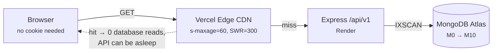
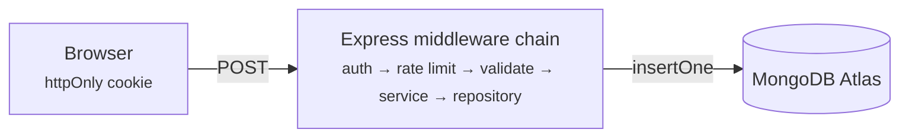
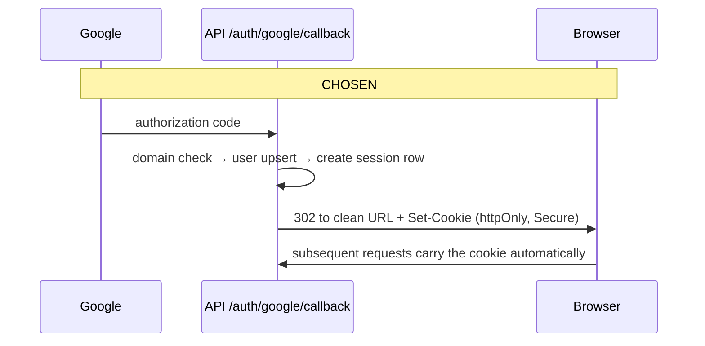

# prepLens — Architecture & Build Plan

**Version 1.0 · 18 September 2026 · Ravi Yadav, NST Rishihood**

A design record written *before* implementation, on purpose.

> Revise this document when a decision changes, and note what forced the change. A design record that only ever agreed with itself was never load-bearing.

---

## Contents

1. [Decisions already locked](#1--decisions-already-locked)
2. [The product, stated precisely](#2--the-product-stated-precisely)
3. [Trust, consent and the anonymity trap](#3--trust-consent-and-the-anonymity-trap)
4. [Data model](#4--data-model)
5. [Indexes, and the habit that goes with them](#5--indexes-and-the-habit-that-goes-with-them)
6. [API contract](#6--api-contract)
7. [Runtime architecture](#7--runtime-architecture)
8. [Auth, and the two holes in the original plan](#8--auth-and-the-two-holes-in-the-original-plan)
9. [Caching, rate limits and per-user data](#9--caching-rate-limits-and-per-user-data)
10. [What earns its place](#10--what-earns-its-place)
11. [Build order](#11--build-order)
12. [Deferred, with triggers](#12--deferred-with-triggers)

---

## 1 · Decisions already locked

These five are settled. Everything downstream follows from them, so changing one means re-reading the sections it touches.

| Decision | Choice | What it forces on the design |
|---|---|---|
| Anonymity | Optional, per post | Identity is derived from `submittedBy`, never typed. Anonymous posts show batch only — see §3. |
| Read access | Public; NST account to post | Content is Google-indexable forever. Consent, retraction and CDN caching all become v1 concerns. |
| Frontend | Vite SPA + OG-meta function | No SSR. Link previews handled by one serverless function; Next.js migration deferred, not precluded (§12). |
| Pace | Depth over speed | Every block ends in something measured, not just something running. |
| Patterns | Layered; GoF where earned | Controller/Service/Repository is real. Singleton and Factory are implemented and honestly labelled (§10). |

---

## 2 · The product, stated precisely

**The job to be done:** a 2028-batch student has a Deloitte interview in nine days and wants to know what round two actually asks, from someone who sat in it.

That sentence is the whole product. Every feature either shortens the path from *"I have an interview"* to *"I know what's coming"*, or it is decoration.

### Anti-goals

Naming what prepLens is *not* is what keeps it shippable.

- **Not a job board.** It never tells you a company is hiring.
- **Not a DSA practice site.** It records the question that was asked; LeetCode solves it.
- **Not a discussion forum.** No threads, no replies. Comments were cut from the schema for exactly this reason — keep them cut.
- **Not a résumé review or referral network.** Those are different products with different trust models.

### The cold-start problem is solved — handle it correctly

A body of existing experiences already exists. That removes the single biggest risk a content archive faces, and replaces it with a smaller, sharper one: **most of that writing is not mine.**

> ### ⚠ Correction to the original plan
>
> Read access is **public**. That means importing a senior's WhatsApp write-up publishes their words, under a permanent Google-indexable URL, possibly alongside the fact that they were rejected. Consent to *"share it in the batch group"* is not consent to that.
>
> So imports land as `status: 'unpublished'` with `consentedAt: null`, and a row goes public only once its author has said yes to **public** hosting. Track that in a spreadsheet keyed by experience id. It costs a week of messages and it is the difference between a product and a leak.

### Launch targets for v1

| Metric | Target | Why this number |
|---|---|---|
| Published experiences at launch | ≥ 25 | Below roughly twenty the archive reads as empty and nobody adds a twenty-sixth. |
| Companies covered | ≥ 12 | Enough that most visitors find *their* company rather than someone else's. |
| Time to first useful screen | < 5 s | Public read means no login wall — the feed must render on a cold CDN in one hop. |
| New submissions, first placement month | ≥ 10 | The only metric that proves it is a community archive and not a personal blog. |

Track the last one honestly. If it comes in at two, the problem is submission friction or incentive, not features — and no amount of backend work fixes it.

---

## 3 · Trust, consent and the anonymity trap

Public read plus student-authored rejection stories is the highest-stakes combination in this design. Get it wrong and a real person is embarrassed on the open internet under their real name.

### Who can do what

| Actor | Read | Post | Edit / retract own | Moderate |
|---|---|---|---|---|
| Anyone on the internet | ✅ | — | — | — |
| NST Google account | ✅ | ✅ | ✅ | — |
| Admin (`role: 'admin'`) | ✅ | ✅ | ✅ | ✅ |

### The k-anonymity trap

"Anonymous · 2027 · CSE" feels anonymous and often isn't. If three people from that batch and branch interviewed at Google and one posts, the batch group works out who wrote it in about four minutes. A label is only anonymous when enough people share it — that is **k-anonymity**, and it is the one privacy concept this product genuinely needs.

> **Rule.** An anonymous experience renders as **batch only** — `Anonymous · 2027`. Never batch + branch, and never branch + company together. Identified posts may show everything, because the author chose to.

### Consent copy — ship these exact words

Not buried in terms. One line directly above the submit button, where it is unavoidable:

```
This will be publicly visible on the internet, including to
recruiters and search engines. You can unpublish it at any time.
```

People consent to *NST seeing it* and are genuinely shocked when Google does. This sentence is the difference.

### Retraction and deletion policy

- **Unpublish is instant and unconditional.** An author hides their own post with one click, no reason required, no admin approval. `status` goes to `'unpublished'`.
- **Deleting an account detaches identity, keeps content.** `submittedBy` becomes `null` and the post is forced anonymous. The archive survives graduation; the person leaves cleanly.
- **State that policy before anyone submits.** A deletion policy discovered after the fact is a broken promise.
- **Nothing is ever hard-deleted by an admin.** Removal sets `status: 'removed'` and writes an audit row. You will need to explain a removal one day.

### Content rules, enforced by the form

- No interviewer names. The form says so; the report flow catches the rest.
- No verbatim proprietary question sets. Many interviews sit under an NDA — "describe the question" is fine, pasting a company's confidential assessment is not.
- No one else's compensation. Your own, optionally, as a band rather than an exact figure.

---

## 4 · Data model

Six collections. Three design rules run through all of them, and each is worth being able to defend out loud:

1. **Normalize for truth, denormalize for reads.** `companies` is the single source of truth for a company's name; `experiences` carries a copy so a feed page needs zero joins.
2. **Snapshot historical facts.** "Written by a 2027 CSE student" stays true forever, even if the author later edits their profile. So it is copied onto the experience, not joined from the user.
3. **Enums over booleans.** A boolean is an enum that hasn't met reality yet. `isSelected: true/false` cannot express "still in process" or "ghosted after round 3" — both of which are real.

### `users` — identity, from Google only

| Field | Type | Notes |
|---|---|---|
| `googleId` | String, unique, required | The stable identity key. Email can change; this cannot. |
| `email` | String, unique, required | Used for the domain check and admin lookup, not as the primary key. |
| `name`, `avatar` | String | From the Google profile, refreshed on each login. |
| `graduationBatch` | Number | e.g. `2027`. Collected once, after first login. |
| `branch` | String, controlled list | `CSE` \| `AI` \| … |
| `role` | String enum, default `'student'` | `'student'` \| `'admin'` |
| `createdAt` | Date | |

**Dropped:** `isVerified`. If only NST emails can log in, every user is verified on creation — the field would be permanently `true` and mislead the next reader. Delete fields that cannot vary.

### `companies` — the taxonomy that keeps the product from rotting

| Field | Type | Notes |
|---|---|---|
| `name` | String, required | Display form, e.g. `Google`. |
| `slug` | String, unique, required | `google`. The join key and the URL segment. |
| `aliases` | [String] | `["Google India", "Google LLC"]`. Feeds autocomplete and the merge tool. |
| `logoUrl` | String, optional | |
| `experienceCount` | Number | Denormalized counter, kept by `$inc`. |
| `status` | String enum | `'active'` \| `'pending'`. A student-submitted new company starts `pending`. |

**Why this exists:** `company: String` would let "Google", "google" and "Googel" coexist. The filter dropdown fragments, the company page splits four ways, and the v3 AI features have no clean grouping key. Free-text taxonomy always rots.

### `experiences` — the archive itself

| Field | Type | Notes |
|---|---|---|
| `companyId` | ObjectId → companies, required | |
| `companySlug`, `companyName` | String | Denormalized copies so the feed and company pages join nothing. |
| `role` | String, controlled list | `SDE` \| `SDE Intern` \| `Data Analyst` \| … |
| `driveType` | String enum | `'on-campus'` \| `'off-campus'` \| `'referral'`. Relevance to a junior depends entirely on this. |
| `interviewYear` | Number | When the interview happened. Named unambiguously on purpose. |
| `outcome` | String enum | `'selected'` \| `'rejected'` \| `'in-process'` \| `'withdrew'` |
| `rounds` | `[{ name, order, questions: [{ text, topic? }], tips }]` | Embedded, because rounds are bounded, always read with the parent, and never queried alone. |
| `submittedBy` | ObjectId → users, nullable | Null after account deletion. |
| `isAnonymous` | Boolean, default `false` | |
| `authorBatch`, `authorBranch` | Number / String | Snapshotted at submit time. Never joined from the user. |
| `status` | String enum | `'published'` \| `'unpublished'` \| `'removed'`. Every public query filters on this. |
| `source` | String enum | `'submitted'` \| `'imported'` |
| `consentedAt` | Date, nullable | An imported row stays unpublished until this is set (§2). |
| `upvoteCount` | Number, default 0 | Denormalized counter (v2). |
| `createdAt`, `updatedAt` | Date | |

**Dropped:** `studentName: String`. It duplicated `users.name` and, worse, was user-typed — anyone could have put anyone's name in it. Never accept identity as input; derive it from `submittedBy`.

### `votes` *(v2)* — one row per person per experience

| Field | Type |
|---|---|
| `userId` | ObjectId → users |
| `experienceId` | ObjectId → experiences |
| `createdAt` | Date |

**Why not `upvotes: [ObjectId]` on the experience** — see §10. This is the single most instructive modelling decision in the project.

### `bookmarks` *(v2)* — same shape, private per user

| Field | Type |
|---|---|
| `userId`, `experienceId`, `createdAt` | As above |

**Privacy:** bookmarks stored on the experience document would ship every bookmarker's id to every reader — anyone could see who is preparing for which company.

### `reports` — v1, not v2

You are hosting claims about named companies.

| Field | Type | Notes |
|---|---|---|
| `experienceId` | ObjectId → experiences | |
| `reporterId` | ObjectId → users | |
| `reason` | String enum | `'interviewer-named'` \| `'confidential'` \| `'false'` \| `'abusive'` \| `'other'` |
| `note` | String, optional | |
| `status` | String enum | `'open'` \| `'actioned'` \| `'dismissed'` |
| `resolvedBy`, `resolvedAt` | ObjectId / Date | The audit trail. |

---

## 5 · Indexes, and the habit that goes with them

Index design is the highest-leverage backend skill there is, and it is the part of the original plan that was completely missing. Every index below exists because a specific query needs it — an index with no named query is dead weight that slows every write.

| Collection | Index | Query it serves | Note |
|---|---|---|---|
| experiences | `{status:1, createdAt:-1, _id:-1}` | Home feed, cursor-paginated | `status` leads because every public query filters it; `_id` is in the index because the cursor tiebreaks on it. |
| experiences | `{status:1, companySlug:1, createdAt:-1, _id:-1}` | Company page, newest first | Equality fields before the sort field — that ordering is the whole trick. |
| experiences | `{submittedBy:1, createdAt:-1}` | "My experiences", account deletion | |
| experiences | text on `rounds.questions.text`, `rounds.tips`, `role` | Content search | MongoDB allows **one** text index per collection — choose the fields and weights deliberately now. |
| companies | `{slug:1}` unique | Slug lookup, duplicate prevention | |
| companies | `{nameLower:1}` | Autocomplete | A prefix-anchored regex `/^goo/` *can* use this index. `/goo/i` cannot — it scans the collection. |
| users | `{googleId:1}` unique | Login upsert | |
| users | `{email:1}` unique | Domain check, admin lookup | |
| votes | `{userId:1, experienceId:1}` unique | Vote once, idempotently | The constraint *is* the feature — see §10. |
| bookmarks | `{userId:1, createdAt:-1}` | My bookmarks, newest first | |
| reports | `{status:1, createdAt:-1}` | Moderation queue | |

> ### The habit
>
> Run `.explain('executionStats')` on every query you write, once, and read three numbers: the stage must be `IXSCAN` and not `COLLSCAN`; `totalDocsExamined` should be close to `nReturned`; and `totalKeysExamined` should not dwarf either. Do this for a week and you will understand databases better than most engineers with three years of experience.

Operationally: declare indexes in the Mongoose schemas, set `autoIndex: false` in production, and create them through an explicit `npm run indexes` script. Auto-indexing on boot is fine on an empty collection and a foot-gun on a full one.

---

## 6 · API contract

Versioned from the first commit — `/api/v1`. Renaming an unversioned API after people have bookmarked it is a self-inflicted wound.

| Method & path | Auth | Cacheable | Notes |
|---|---|---|---|
| `GET /auth/google` | — | No | Redirect to Google. |
| `GET /auth/google/callback` | — | No | Domain check, user upsert, sets cookie, redirects clean (§8). |
| `GET /auth/me` | Cookie | No | `200` with user, or `204` when signed out — not a `401`, since signed-out is the normal public state. |
| `POST /auth/logout` | Cookie | No | Clears cookie and revokes the session row. |
| `GET /experiences` | Public | ✅ | Cursor-paginated. Filters: `company`, `role`, `outcome`, `year`, `q`. |
| `GET /experiences/:id` | Public | ✅ | `404` for any status other than `published`, unless the caller is the author or an admin. |
| `GET /companies` | Public | ✅ | Filter dropdown + autocomplete source. Long TTL. |
| `GET /stats` | Public | ✅ | Archive size counter. Computed, cached 5 min. |
| `POST /experiences` | Cookie | No | Validated; resolves or queues the company. |
| `PATCH /experiences/:id` | Author | No | Author-only field whitelist. |
| `POST /experiences/:id/unpublish` | Author | No | Unconditional retraction (§3). |
| `POST /reports` | Cookie | No | Moderation intake. |
| `GET /me/interactions?ids=` | Cookie | **Never** | Per-user vote/bookmark state, kept out of the cacheable payloads (§9). |
| `GET /admin/reports` | Admin | No | Queue, oldest open first. |
| `POST /admin/experiences/:id/remove` | Admin | No | Soft remove + audit row. |

### Cursor pagination, not `skip`

`?page=2` with `.skip(10)` re-walks everything it skips, and if a new experience is posted between two page loads the reader sees a duplicate row. Keyset pagination costs the same to write and is simply correct.

```http
GET /api/v1/experiences?company=google&limit=20
GET /api/v1/experiences?company=google&limit=20&cursor=eyJjIjoiMjAyNi0wOC0xMVQwOTozMCIsImkiOiI2NmI0In0
```

```json
{
  "data": [ "… 20 experiences …" ],
  "page": { "nextCursor": "eyJjIjoi...", "hasMore": true }
}
```

```js
// the query behind it — the cursor encodes the last row's sort key
const filter = { status: 'published' };
if (slug) filter.companySlug = slug;

if (cursor) {
  const { c, i } = decodeCursor(cursor);          // createdAt, _id
  filter.$or = [
    { createdAt: { $lt: c } },                    // strictly older
    { createdAt: c, _id: { $lt: i } },            // same instant, tiebreak
  ];
}

const rows = await Experience
  .find(filter)
  .sort({ createdAt: -1, _id: -1 })               // matches the index exactly
  .limit(limit + 1);                              // the +1 answers hasMore
```

The `_id` tiebreak matters: two experiences imported in the same batch can share a `createdAt` to the millisecond, and without it the page boundary is undefined.

### One error envelope, everywhere

```json
{
  "error": {
    "code": "VALIDATION_FAILED",
    "message": "Company is required.",
    "fields": { "company": "required" }
  },
  "requestId": "01JB7Q2K9X"
}
```

The `requestId` is the same value the logger stamps on every line for that request (§11). A user reports a bug, quotes the id, and you find the exact request. That one field is most of what "observability" means at this size.

---

## 7 · Runtime architecture

Public read changes the shape of this system fundamentally. The archive is read-constantly and written-rarely — perhaps 30 writes a month against thousands of reads — and reads need no identity at all. That asymmetry *is* the design.

### Read path — public, cacheable



### Write path — authenticated, never cached



Writes skip the CDN entirely; a new post is publicly visible once the 60-second TTL lapses. The read path's real value is the dashed return arrow above: on a cache hit nothing downstream is touched — which is also what masks Render's cold starts.

### What breaks, and what the user sees

| Component | Failure | User sees | Mitigation |
|---|---|---|---|
| Render instance | Free tier sleeps after ~15 min idle; 30–60 s cold start | A hanging white page they assume is broken | CDN absorbs most reads; skeleton UI; **move to the paid instance before launch** — this one will embarrass you otherwise. |
| Atlas M0 | Connection limit, shared-tier throttling | `500`s under load | One pooled connection per process, `maxPoolSize: 10`, never connect per request. |
| Google OAuth | Unverified consent screen, quota, redirect mismatch | Login loop | Catch the callback error and render a readable page naming the cause. Never redirect back into the flow. |
| CDN staleness | Cached feed is up to 60 s old | Author submits, doesn't see their post | After submit, route the author to their own experience by id and bypass cache when a session cookie is present. |
| Bad deploy | API returns `500`s | Archive still reads fine | `stale-while-revalidate=300` keeps serving the last good response for five minutes. A free degradation layer you get purely from a header. |

---

## 8 · Auth, and the two holes in the original plan

Google OAuth with a domain check is the right call: no passwords to store, no reset flow, and the college account *is* the verification. Two details in the original plan were wrong, and both are worth understanding rather than just patching.

### Hole one — the token in the redirect URL

The common tutorial pattern signs a JWT in the callback and redirects to `preplens.app/?token=eyJhbGciOi…`. That token is now in the browser's history, leaked in the `Referer` header of the next outbound link, and recorded in the host's access logs. In `localStorage`, any XSS bug can read it.



The difference is one arrow. An `httpOnly` cookie is unreadable to JavaScript, so an XSS bug cannot exfiltrate the session, and the token never appears in a URL at all.

| Attribute | Value | Stops |
|---|---|---|
| `httpOnly` | `true` | JavaScript — and therefore XSS — reading the session. |
| `secure` | `true` in production | The cookie ever crossing plain HTTP. |
| `sameSite` | `'none'` cross-site, `'lax'` same-site | CSRF. `'none'` is only needed while the API lives on a different site from the frontend. |
| `maxAge` | 7 days | An abandoned laptop staying signed in forever. |

> ### ⚠ The evening this will cost you
>
> `preplens.vercel.app` and `preplens-api.onrender.com` are different sites, so the session cookie needs `SameSite=None; Secure`, CORS with `credentials: true` and an explicit origin — never `*`, which browsers reject outright when credentials are involved. Axios needs `withCredentials: true` on every call.
>
> The cheaper path: one domain from the start — `preplens.app` for the frontend, `api.preplens.app` for the API. Same site, `SameSite=Lax`, no cross-site cookie problem at all.

### Hole two — logout doesn't log anyone out

"JWT expires in 7 days" and "session persists until logout" cannot both be true. A signed JWT is valid until it expires, and nothing on the server can take that back — clearing the cookie clears the browser's *copy*. Anyone who captured the token keeps a working session for up to seven days after the user pressed logout.

| Option | Cost | Verdict |
|---|---|---|
| **Opaque session id in the cookie**, a `sessions` collection server-side | One indexed read per request; a TTL index expires rows automatically | **Chosen.** Logout becomes a real delete, and you can list and revoke a user's devices. |
| Short access JWT (15 min) + refresh token rotation | Meaningfully more code and more edge cases | The right answer at scale, overkill at 500 users. |
| 7-day JWT, accept that logout is cosmetic | Free | Acceptable only if documented. Undocumented, it is just a bug. |

JWT is still *used* for the Google handoff — this only changes what the browser holds afterwards. Being able to explain why a stateless token can't be revoked, and what you traded to fix it, is worth more in an interview than the token itself.

> ### ⚠ Correction to the original plan: never share admin credentials
>
> With Google OAuth there are no credentials to share — there is no password, only a Google account. Handing over a login would mean handing over an entire Google identity.
>
> Admin is a field, not an account: `users.role = 'admin'`. Promoting someone is a one-line database update, or a `SUPER_ADMIN_EMAILS` env list that auto-promotes on login. Demoting them is the same, instantly. Every admin action writes `resolvedBy`, so the audit trail names a person rather than "the admin account" — which is the entire point of having one.

---

## 9 · Caching, rate limits and per-user data

### The rule that makes public caching safe

> **Non-negotiable.** A cacheable response must be **identical for every caller**. The moment `GET /experiences` includes a `hasUpvoted` field, a shared CDN can serve your answer to someone else — and one user's state leaks to every reader of that URL.
>
> So per-user state lives in its own uncached call: `GET /me/interactions?ids=a,b,c`. The feed is public and cached; the highlighted vote buttons arrive in a second request. This split is why the architecture works at all.

### Rate limits — keyed correctly

The original plan's "100 requests / 15 min per IP" would have banned the campus: hundreds of students share one NAT address on college wifi, so one keen user locks out everyone. Authenticated routes must be keyed on the *user*.

| Route class | Limit | Keyed on | Reason |
|---|---|---|---|
| Public `GET`s | 300 / 5 min | IP | Scrapers. Generous because the CDN absorbs most of it and the campus shares an address. |
| `/auth/*` | 10 / 15 min | IP | Stops OAuth redirect-loop abuse. |
| `POST /experiences` | 5 / day | userId | Spam floor. Nobody writes six genuine experiences in a day. |
| Vote / bookmark | 60 / min | userId | Button mashing. |
| `POST /reports` | 10 / day | userId | Report brigading. |

A note for the writeup: `express-rate-limit`'s default is a **fixed window**, which allows a 2× burst across the boundary — 100 requests at 14:59 and 100 more at 15:00. A token bucket or sliding window smooths that. At this scale the fixed window is fine; knowing why it is imperfect is the part that counts.

### The scale ladder

| Stage | Users | What actually changes | Signal you've arrived |
|---|---|---|---|
| **Now** | 0 – 1,000 | Paid Render instance, Atlas M0, CDN cache headers, the indexes in §5, Sentry | Launch day. |
| **Next** | 1k – 10k | Atlas M10, pool tuning, split read/write limits, cache the detail pages too | p95 latency past 800 ms, or Atlas CPU over 60% sustained. |
| **Later** | 10k+ | Redis for the company list and counters, Atlas Search for text, a read replica | Identical repeated queries pinning database CPU. |

> **Say this out loud in the viva.** prepLens will almost certainly never reach stage three — NST does not have ten thousand students. Write the ladder anyway. **Knowing the trigger is the engineering skill; building stage three on day one is the mistake** that sinks real projects.

---

## 10 · What earns its place

The original plan listed six design patterns. Here is the honest audit — and then the list of concepts that will actually make this a production-grade backend.

| Pattern | Verdict | Honest note |
|---|---|---|
| Controller → Service → Repository | **Real** | Lets you test a service with no database running, and gives every indexed query one home. The one structural choice that pays at every size. |
| Singleton (DB connection) | **Ceremony** | Mongoose already maintains a single pooled connection — a Singleton wrapper adds no runtime guarantee. Keep it to make the intent explicit, and *say that* when asked. That answer is worth more than the pattern. |
| Factory (response envelope) | **Rename it** | It is `ok()` and `fail()`. Keep the helper — it is genuinely useful — and drop the grand name. |
| Chain of Responsibility (middleware) | **Not yours** | Express designed it; you are using it. You can describe the pattern, you cannot claim it as your design decision. |
| Observer (notifications) | **Deferred** | There are no notifications in v1. When there are, it wants a real queue, not an in-process `EventEmitter` that loses events on restart. |

### The modelling decision that teaches the most

**Option A — array inside the parent document**

```js
// experiences/e12
{
  companyName: "Google",
  rounds: [ /* … */ ],
  upvotes: [ u1, u2, u3, /* … */ u412, /* … */ ]   // unbounded
}
```

- One vote rewrites the entire document.
- The array grows toward MongoDB's 16 MB ceiling.
- Every read ships every voter's id to every reader — a privacy leak.
- "Who upvoted" can never be paginated or sorted.

**Option B — separate collection + denormalized counter**

```js
// experiences/e12
{ upvoteCount: 412 }

// votes/…  — one small row per vote
{ userId: u9,  experienceId: e12 }
{ userId: u10, experienceId: e12 }

// index
{ userId: 1, experienceId: 1 }   // unique
```

A vote inserts one small row and `$inc`s one number. At 500 users option A works — it is still worth building B, because the unique compound index is a different *kind* of correctness: the database refuses the second vote, rather than your code checking first and losing the race between two taps.

That distinction — **an application-level check versus a database constraint** — is the single most transferable idea in this document. "We check if the user already voted" is racy: two concurrent requests both read "no vote yet" and both insert. A unique index cannot be raced, because uniqueness is enforced where the write lands.

### Concepts to learn, and how to prove you did

Lead the course submission with this table rather than the pattern list. Every row is a claim with evidence attached.

| Concept | Where it lives | How you prove you learned it |
|---|---|---|
| Index design | §5 | `.explain()` shows `IXSCAN` with `totalDocsExamined ≈ nReturned`. Paste the output. |
| Keyset pagination | §6 | Insert a row while on page 1, load page 2, show that no row is duplicated or skipped. |
| Idempotency | votes, imports | Fire the same vote request twice; the count stays 1. Run the import twice; no duplicates. |
| Cache invalidation | §9 | A new post appears publicly within 60 s, while its author sees it instantly. |
| Denormalization | `companyName` on experience | The company page renders with zero `$lookup` stages. |
| Observability | pino + `requestId` | Trace one slow request end to end from a single log line. |
| Graceful degradation | `stale-while-revalidate` | Stop the API; show that the archive still reads for five minutes. |
| Constraint vs. check | unique indexes | Explain the race the unique index closes, with the two-request timeline. |

---

## 11 · Build order

Ten blocks. Each ends in something you can demonstrate and, wherever possible, something you can *measure* — that is what "depth over speed" means in practice. Do not start a block before the previous one's **done when** is genuinely true.

### Block 0 — Ground rules

- [x] Repository layout decided: monorepo — `api/` and `web/` inside `PrepLens`, alongside `docs/`. One clone, one link to share; Vercel and Render both deploy from a subdirectory.
- [x] `.env.example` committed, with a zod schema that validates env at boot and **crashes with a readable message** on a missing `SESSION_SECRET`.
- [x] `pino` logger plus a middleware that stamps a `requestId` on every log line, echoes it in every error response, and returns it as an `x-request-id` header. An inbound id is accepted only if well-formed, so log correlation is not a place untrusted input lands.
- [x] `GET /healthz` returning version, commit SHA, environment and uptime. Database ping is added in Block 1, once there is a connection to check.
- [x] One global error handler and the single error envelope from §6. No `res.status(500).json({msg})` scattered through controllers. Express 5 forwards rejected promises to it, so there is no `asyncHandler` wrapper anywhere.
- [x] `/api/v1` prefix wired from the first route.

**Done when** `npm run dev` boots, `/healthz` returns 200, and deleting `SESSION_SECRET` from `.env` produces a one-line explanation instead of a stack trace. — **Done, 18 Sep 2026.** Two bugs found and fixed during verification: `logger.fatal()` immediately before `process.exit()` silently lost the message, and an async success log could print "listening" after a boot had already failed.

### Block 1 — Data layer

- [ ] Atlas cluster, database user, IP allowlist. Connection string in `.env` only.
- [ ] Connection module: one connection per process, `maxPoolSize: 10`, connect once at boot — never per request. (This is the Singleton; label it honestly.)
- [ ] All six schemas from §4, enums included.
- [ ] Every index from §5 declared in the schemas; `autoIndex: false` in production; `npm run indexes` creates them explicitly.
- [ ] Repository layer: all database access behind `experienceRepository` / `userRepository`. No `Model.find` in a controller, ever.
- [ ] Idempotent seed script: 8 companies, 3 experiences. Running it twice must not duplicate anything.

**Done when** the seed is idempotent and `.explain('executionStats')` on the feed query shows `IXSCAN`. Save that output — it goes in the submission.

### Block 2 — Auth

- [ ] Google Cloud OAuth client; redirect URIs for local and production.
- [ ] Passport Google strategy; reject any email outside `COLLEGE_EMAIL_DOMAIN` with a readable page, not a redirect loop.
- [ ] User upsert keyed on `googleId`; refresh name and avatar on every login.
- [ ] `sessions` collection with a TTL index; opaque session id in an `httpOnly` cookie. No token in any URL (§8).
- [ ] First-login profile step collecting `graduationBatch` and `branch`.
- [ ] `requireAuth` and `requireAdmin` middleware; `SUPER_ADMIN_EMAILS` promotes on login.
- [ ] `GET /auth/me` returns `204` when signed out; `POST /auth/logout` deletes the session row.

**Done when** a personal Gmail account is refused with a sentence that explains why, and a logged-out session id is genuinely dead — verify by replaying the old cookie.

### Block 3 — Public read APIs

- [ ] `GET /experiences` with keyset cursor, plus `company`, `role`, `outcome`, `year` filters.
- [ ] `GET /experiences/:id`, `404` unless published or the caller is author/admin.
- [ ] `GET /companies` and `GET /stats`, both cached.
- [ ] `Cache-Control: public, s-maxage=60, stale-while-revalidate=300` on public reads — and **no per-user field in any of those payloads** (§9).
- [ ] `GET /me/interactions?ids=` for per-user state, explicitly `no-store`.
- [ ] Text search on `?q=` using the text index — not a regex scan.

**Done when** inserting an experience mid-scroll leaves page 2 correct with no duplicate row, and response headers show the cache directives. Screenshot both.

### Block 4 — Write APIs

- [ ] `POST /experiences`: validated, company resolved by slug or queued as `pending`, author fields snapshotted server-side.
- [ ] Reject any client-supplied author identity. Identity comes from the session, full stop.
- [ ] `PATCH /experiences/:id` with an author-only field whitelist.
- [ ] `POST /experiences/:id/unpublish` — instant, unconditional (§3).
- [ ] `POST /reports`.
- [ ] Rate limits per §9, keyed on `userId` for authenticated routes.

**Done when** submitting "Google", "google " and "Google India" all resolve to `companySlug: 'google'`, and a second identical submit within a second does not create a second row.

### Block 5 — Fill the archive

- [ ] Inventory every experience already held: author, company, year, where it came from.
- [ ] Consent tracker keyed by experience id. Ask each author explicitly about **public** hosting (§2).
- [ ] Import script: `source: 'imported'`, `status: 'unpublished'`, `consentedAt: null`. Idempotent, re-runnable.
- [ ] Publish only on recorded consent; offer anonymity in the same message that asks for it.
- [ ] Normalize every imported company against the `companies` collection; merge the aliases found.

**Done when** ≥ 25 experiences are published, each with a recorded consent date, spanning ≥ 12 companies. This block is what makes prepLens a product rather than a demo — do not skip ahead to the frontend because it is more fun.

### Block 6 — Frontend foundation

- [ ] Vite + Tailwind + React Router; axios instance with `withCredentials: true`.
- [ ] `AuthContext` + `useAuth`; a signed-out visitor is a *normal* state, not an error.
- [ ] Public feed with filters and cursor-based "load more"; skeleton states that survive a 40 s cold start.
- [ ] Experience detail page, rounds rendered in order, anonymous authors shown as `Anonymous · 2027` only.
- [ ] Serverless OG-meta function for `/experience/:id`: title, company, role, outcome.
- [ ] `ProtectedRoute` for submit and profile only — never for reading.

**Done when** a link pasted into the batch WhatsApp group shows a real preview with the company name, and the feed renders for a logged-out visitor on a phone.

### Block 7 — Submit flow and moderation

- [ ] **Quick submit**: company, role, outcome, one free-text box. Under two minutes.
- [ ] Full round-by-round form with add/remove rounds, built on `react-hook-form`.
- [ ] Company autocomplete against `/companies`, with "can't find it?" → pending.
- [ ] Anonymity toggle and the exact consent sentence from §3 above the button.
- [ ] Content rules shown inline: no interviewer names, no confidential material.
- [ ] Report button; admin queue page; soft remove writing `resolvedBy` and `resolvedAt`.
- [ ] "My experiences" page with unpublish.

**Done when** you can remove a post from the UI and answer, from the database alone, who removed it and when.

### Block 8 — Launch

- [ ] Paid Render instance. Free-tier cold starts will make a working product look broken.
- [ ] Custom domain: `preplens.app` and `api.preplens.app` — same site, no cross-site cookie problem (§8).
- [ ] CORS locked to the frontend origin. Never `*`.
- [ ] Sentry on both sides; an uptime check on `/healthz`.
- [ ] Two test files with `supertest` + `mongodb-memory-server`: the auth middleware, and the submit endpoint.
- [ ] Announce to the batch with three specific experiences linked directly — never just a bare homepage link.

**Done when** a junior finds a relevant experience without asking for the link. That is the actual launch criterion.

### Block 9 — v2, only after real usage

- [ ] Votes: `votes` collection, unique compound index, `$inc` counter, idempotent endpoint (§10).
- [ ] Bookmarks, private per user.
- [ ] Company stats page: experience count, selection rate, most common rounds.
- [ ] "Request an experience" — demand signal, and the strongest prompt to write one.
- [ ] A nightly job reconciling `upvoteCount` against the `votes` collection. Denormalized counters drift; own that.

**Done when** a double-tapped vote button leaves the count at exactly 1, and the reconciliation job reports zero drift.

---

## 12 · Deferred, with triggers

A deferred decision without a trigger is just a decision you forgot. Each of these has a condition that means "now revisit it".

| Deferred | Revisit when | What changes |
|---|---|---|
| Next.js migration | Organic search becomes a top-3 traffic source, or per-experience OG images are wanted | Server rendering; the Express API stays exactly as it is. Keep all data access behind `api/` so this stays a frontend-only migration. |
| Redis | Identical repeated queries pin Atlas CPU | Cache the company list and stats. Not the feed — the CDN already owns that. |
| Atlas Search | Text-index relevance draws complaints, or typo tolerance is asked for | Replace the `$text` query inside the repository. Nothing above it changes — which is the payoff of the repository layer. |
| Notifications | 100+ weekly active users | A real queue. Not an in-process `EventEmitter`. |
| AI prep suggestions (v3) | ≥ 50 experiences across ≥ 20 companies | Needs volume to be non-embarrassing. Structured `questions[].topic` is what makes it tractable — which is why the field exists in §4 now. |

### Still open

- **Edit window.** Can an author edit an experience forever, or only for 24 hours? Forever is friendlier; a permanent edit right on public content makes the archive unquotable. Lean: unlimited edits, but show `updatedAt` when it differs from `createdAt`.
- **Compensation data.** Include CTC bands at all? High value to juniors, high social friction on a public site. Lean: omit from v1 entirely — it is the one field most likely to make people stop posting.
- **Alumni access.** A graduate's `@nst.rishihood.edu.in` account may be deactivated. They can still read, but can they still post or unpublish? Decide before the first batch graduates.

---

*prepLens · architecture and build plan, v1.0 · 18 September 2026 · Ravi Yadav, NST Rishihood.*
