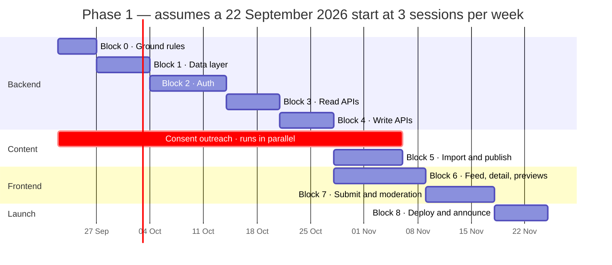

# prepLens — Delivery Plan

**Version 1.0 · 18 September 2026 · Ravi Yadav, NST Rishihood**

Companion to [`SPEC.md`](SPEC.md) (what it does) and [`ARCHITECTURE.md`](ARCHITECTURE.md) (how it is built). This document is *sequence, effort and risk*.

---

## Contents

- [How to use this plan](#how-to-use-this-plan)
- [Estimating unit and assumptions](#estimating-unit-and-assumptions)
- [Phase 1 — Launch the archive](#phase-1--launch-the-archive)
- [Phase 2 — Engagement and signal](#phase-2--engagement-and-signal)
- [Phase 3 — Intelligence](#phase-3--intelligence)
- [Risk register](#risk-register)
- [Decision log](#decision-log)
- [Definition of done](#definition-of-done)
- [Triggers to stop and re-plan](#triggers-to-stop-and-re-plan)

---

## How to use this plan

1. **Work one block at a time, in order.** Blocks are sequenced by dependency, not by preference. Skipping ahead to the frontend because it is more visible is the single most common way a project like this dies with a beautiful feed and no content in it.
2. **A block is finished when its *done when* passes** — the criteria in [`ARCHITECTURE.md` §11](ARCHITECTURE.md#11--build-order), not when the code compiles.
3. **Requirements come from the spec.** Before starting a block, read the requirement IDs it implements (see the [traceability table](SPEC.md#traceability)). Build to the acceptance criteria, not to memory.
4. **Update this file when reality disagrees with it.** A plan that is never revised was never consulted. Record what changed and why in the [decision log](#decision-log).

---

## Estimating unit and assumptions

Estimates are in **sessions**: one focused block of roughly 2–3 hours with no context switching. Calendar dates are derived, not promised.

| Assumption | Value | If this changes |
|---|---|---|
| Sessions per week | 3 | Divide or multiply the calendar span directly |
| Session length | 2–3 focused hours | Fewer hours per session stretches every block proportionally |
| Learning overhead | Included | Estimates assume learning each concept properly, not copying a tutorial |
| Start date | 22 September 2026 | Shift the whole schedule; the sequence is unaffected |
| Availability | Alongside coursework | Assume weeks will be lost to exams — the plan has no buffer built in, so expect the calendar to slip and the sequence to hold |

**Estimates are ranges because the first time you do something takes longer than the second.** OAuth in particular has a wide band: the code is small and the configuration is fiddly.

---

## Phase 1 — Launch the archive

**Goal:** a junior can find and read real interview experiences, and a senior can add one in under two minutes.

### Milestones

| Block | Deliverable | Sessions | Depends on | Spec coverage |
|---|---|---|---|---|
| **0** | Ground rules — env validation, structured logging, `/healthz`, error envelope, `/api/v1` | 2 | — | OPS-01 … OPS-04 |
| **1** | Data layer — six schemas, every index, repositories, idempotent seed | 3 | 0 | Supports all |
| **2** | Auth — Google OAuth, domain check, server sessions, cookies, role middleware | 3–5 | 1 | AUTH-01 … AUTH-06 |
| **3** | Public read APIs — cursor pagination, filters, text search, cache headers | 3 | 1 | FEED-01 … FEED-08, READ-04 |
| **4** | Write APIs — submit, edit, retract, report, per-user rate limits | 3 | 2, 3 | SUB-01 … SUB-08, CONS-04, MOD-01 |
| **5** | Fill the archive — inventory, consent, import, company normalization | 3–4 | 4 | IMP-01 … IMP-05 |
| **6** | Frontend foundation — feed, detail, filters, auth context, OG previews | 5 | 3 | FEED, READ-01 … READ-03 |
| **7** | Submit flow and moderation UI — quick submit, consent line, admin queue | 4 | 4, 6 | SUB-02, CONS-01 … CONS-03, MOD-02 … MOD-06 |
| **8** | Launch — paid instance, domain, monitoring, tests, announcement | 3 | all | OPS-05, NFR-A2, NFR-S2 |

**Total: 29–32 sessions** ≈ 10–11 weeks at three sessions per week.

### Schedule

### The critical path is consent, not code

Blocks 0 → 8 are the coding path. The **real** critical path runs through Block 5, and most of Block 5 is not programming: it is messaging seniors and waiting for replies. Waiting has calendar cost and zero effort cost, which makes it the easiest thing to under-plan and the most likely thing to delay launch.

> **Therefore: start the consent outreach in week 1, in parallel with Block 0.** Inventory what you hold, work out who wrote each piece, and start asking — explicitly about **public** hosting, as [`SPEC.md` IMP-02](SPEC.md#importing-the-existing-archive) requires. By the time the import script exists in Block 5, the answers should already be collected.

Doing this sequentially — building everything, then asking — adds three to four idle weeks before launch and is the difference between launching in November and launching in December.

### Order within a block

For every backend block: **schema or route shape → repository → service → controller → manual verification → measurement.** The measurement step is what makes this project worth doing:

| Block | What to measure | Where it goes |
|---|---|---|
| 0 | Boot fails readably with a missing env var | Screenshot for the submission |
| 1 | `.explain('executionStats')` on the feed query | Paste the `IXSCAN` output |
| 2 | Replayed cookie after logout is rejected | Note the before/after |
| 3 | Page 2 after a mid-scroll insert has no duplicate | Screenshot both pages |
| 4 | Three company spellings resolve to one slug | Database query output |
| 8 | API stopped, archive still readable | The stale-while-revalidate window in action |

---

## Phase 2 — Engagement and signal

**Precondition:** Phase 1 live for a placement-cycle month with ≥ 10 organic submissions. If submissions are at two, the problem is friction or incentive — fix that instead of building Phase 2.

| Block | Deliverable | Sessions | Spec coverage |
|---|---|---|---|
| **9a** | Votes — `votes` collection, unique compound index, counter, idempotent endpoint | 3 | VOTE-01 … VOTE-04 |
| **9b** | Bookmarks and the per-user interactions endpoint | 2 | BOOK-01 … BOOK-03 |
| **9c** | Company pages and stats, with small-sample labelling | 3 | STAT-01 … STAT-03 |
| **9d** | Profiles and "request an experience" | 3 | PROF-01, REQ-01 … REQ-03 |
| **9e** | Reconciliation job for denormalized counters | 1 | VOTE-05 |

**Total: 12 sessions** ≈ 4 weeks.

Build 9a first and 9d second if submissions are the concern — the request loop is the strongest prompt to write an experience, and voting is merely nice. 9c is the most visible and the least important; do not let that reverse the order.

---

## Phase 3 — Intelligence

**Precondition:** ≥ 50 published experiences across ≥ 20 companies. Below that, a generated guide is thinner than the source material and costs trust.

| Block | Deliverable | Sessions | Spec coverage |
|---|---|---|---|
| **10a** | Anthropic SDK integration — client, config, token usage logging, spend ceiling | 2 | AI-11 |
| **10b** | Guide generation — archive as cited documents, structured output, prompt versioning | 4 | AI-01, AI-02, AI-14 |
| **10c** | Precompute pipeline — batch regeneration, change-triggered invalidation, storage | 3 | AI-03, AI-04, AI-06, AI-07 |
| **10d** | Guide UI — labelled as generated, citations linked to source experiences | 2 | AI-05 |
| **10e** | Evaluation — held-out companies, manual unsupported-claim review | 2 | AI-15 |
| **11a** | Query understanding — natural language to filters plus keywords | 3 | AI-08, AI-10 |
| **11b** | Graceful degradation to plain text search | 1 | AI-09, AI-13 |

**Total: 17 sessions** ≈ 6 weeks.

### Technical shape

- **Surface:** Anthropic TypeScript SDK (`@anthropic-ai/sdk`) called from the existing Express backend. No new service.
- **Model:** `claude-opus-5` (1M context, $5 / $25 per million input / output tokens).
- **Grounding:** each company's experiences are passed as document blocks with citations enabled, so every generated claim carries a pointer back to the experience it came from. This is the anti-hallucination mechanism, and `AI-02` makes an uncited claim unrenderable rather than merely discouraged.
- **Bulk regeneration:** the Message Batches API, at 50% of standard cost.
- **Caching:** the system prompt and stable instructions sit before the per-company content so repeated runs read from cache.
- **Structured output** for query understanding, so the parsed filters are schema-valid rather than parsed out of prose.

Full cost model in [`SPEC.md` § Cost model](SPEC.md#cost-model--phase-3): roughly **$1.15 to regenerate 20 company guides through the Batch API**. The cost risk in this phase is architectural, not per-token — generating on demand instead of precomputing is what turns a $1 line item into a problem, which is why `AI-03` exists.

---

## Risk register

Ordered by expected damage, highest first.

| Risk | Likelihood | Impact | Mitigation | Early warning sign |
|---|---|---|---|---|
| **Consent replies never arrive**, so the archive launches near-empty | High | Fatal to launch | Start outreach in week 1; ask in person where possible; accept anonymous publication as the easier "yes" | Fewer than 10 consents by week 4 |
| **Launch happens, then nobody submits** | High | Product becomes a personal blog | Quick-submit path under two minutes; request loop in Phase 2; ask three specific seniors directly rather than broadcasting | Zero organic submissions in the first fortnight |
| **Scope creep into Phase 2 during Phase 1** | High | Launch slips indefinitely | Votes and bookmarks are physically absent from the Phase 1 schema work; they are Block 9 | Catching yourself "just adding" an upvote button |
| **Free-tier cold starts read as a broken site** | Certain if unaddressed | First impression lost | Paid instance before announcing; skeleton states; CDN absorbs most reads | A 40 s white page on your own phone |
| **Cross-site cookie configuration burns days** | Medium | Days lost, morale hit | Buy the domain early; run frontend and API as same-site subdomains | Cookies working locally, vanishing in production |
| **A defamatory or confidential post appears** | Low per post, rises with volume | Reputational and possibly legal | Reports and soft removal ship in Phase 1; content rules inline at submit; no interviewer names | The first report arriving with no queue to receive it |
| **Coursework eats the schedule** | Certain | Calendar slips, sequence holds | Blocks are individually shippable; no block depends on finishing within a specific week | Two weeks with no session |
| **Generated guides state things no experience supports** | Medium | Trust in the archive, which is the whole asset | Citation-grounded generation, unsupported claims unrenderable, held-out evaluation before rollout | Any unsupported claim found during review |
| **A denormalized counter drifts** | Medium | Minor incorrectness | Reconciliation job from day one of Phase 2 | Counter disagreeing with a manual count |

The top three are all product risks, not engineering ones. That ordering is the honest picture of where this project can fail.

---

## Decision log

| Date | Decision | Rationale | Revisit when |
|---|---|---|---|
| 2026-09-17 | Optional per-post anonymity | Rejection stories are the most valuable content and the least likely to be posted under a real name | Never — removing it would cost the best content |
| 2026-09-17 | Public read, NST account to post | Reach and shareability; a login wall kills discovery from a WhatsApp link | If consent fatigue shows students are uncomfortable with public hosting |
| 2026-09-17 | Vite SPA now, Next.js deferred | Learning the backend is the goal; RSC would consume weeks without serving it | Organic search becomes a top-3 traffic source |
| 2026-09-17 | Opaque server sessions instead of a 7-day JWT | Logout must actually revoke; JWT cannot be un-issued | If session reads ever become a measured bottleneck |
| 2026-09-17 | Companies are their own collection | Free-text company names fragment the archive irreversibly | Never |
| 2026-09-17 | Votes as a separate collection with a unique index | Unbounded arrays in the parent document, and a racy application-level check | Never |
| 2026-09-17 | Admin is a role flag, never shared credentials | OAuth has no password to share; audit trails must name a person | Never |
| 2026-09-18 | Reports and soft removal are Phase 1, not Phase 2 | Hosting public claims about named companies without a moderation path is a liability | Never |
| 2026-09-18 | Phase 3 precomputes guides, never generates per request | Latency, cost and cache behaviour all fail on the on-demand shape | If per-user personalized guidance is ever genuinely needed |
| 2026-09-18 | Monorepo — `api/` and `web/` inside `PrepLens` — instead of two repositories | Docs sit beside the code they describe; one clone and one link for the course. Both hosts deploy from a subdirectory, so nothing is lost | If a second contributor needs write access to only one half |
| 2026-09-18 | JavaScript (ESM), not TypeScript | Matches the documented stack, and keeps attention on the backend concepts — indexes, pagination, caching — rather than on a type system | If the codebase outgrows what can be held in one head, or a teammate joins |
| 2026-09-18 | `SESSION_SECRET` replaces `JWT_SECRET` in the environment | The session design signs a cookie; there is no JWT to hold a secret for | Never — the name now matches what it does |
| 2026-09-18 | `rounds[].order` removed from the schema; order derived from array position | Storing it beside the array index is two sources of truth for one fact, and the hook maintaining it silently did not run on query updates | Never |
| 2026-09-18 | Every index declared once, via `schema.index()` with an explicit name — never `unique: true` on the field | Two declarations of the same keys fail with `IndexOptionsConflict`, and a name you chose is greppable and readable in `.explain()` output | Never |
| 2026-09-18 | Text search returns one relevance-ranked page rather than pretending to paginate | A keyset cursor is only valid over the sort it was built for; relevance and recency are different sorts | Atlas Search, per §12 |
| 2026-09-18 | Graceful shutdown lets the process exit naturally instead of calling `process.exit(0)` | Exiting right after a log call races the logger's transport and drops the last line | If a stray handle ever keeps the loop open |
| 2026-09-18 | Boot-time fatal errors print with `console.error`, not the logger | `logger.fatal()` followed by `process.exit()` loses the line: pino's transport is a worker thread that never flushes. A crash with no log entry is the worst failure mode | If the logger gains a synchronous destination |

---

## Definition of done

**A task** is done when the behaviour works, the failure path is handled, and it is not hard-coded to your own account or machine.

**A block** is done when:
1. Every task is done.
2. The block's *done when* in [`ARCHITECTURE.md` §11](ARCHITECTURE.md#11--build-order) passes.
3. The acceptance criteria for its spec requirements pass.
4. The measurement for that block (table above) is captured, where one exists.
5. It is committed and pushed. An unpushed block does not exist.

**A phase** is done when its exit criteria in [`SPEC.md`](SPEC.md) pass with real users — not when the last block is merged.

---

## Triggers to stop and re-plan

Do not push through these; they mean the plan is wrong, not that you are behind.

| Trigger | What it means | What to do |
|---|---|---|
| Fewer than 10 consents by week 4 | The content strategy is not working | Stop building. Solve consent — in person, or by defaulting to anonymous publication |
| Block 2 exceeds 6 sessions | OAuth configuration has become a rabbit hole | Ship domain-check-only auth against a stub, come back after Block 3 |
| Zero organic submissions in the fortnight after launch | Friction or incentive, not features | Watch a real student try to submit; fix what you see; skip Phase 2 until this moves |
| Any Phase 1 requirement cannot be met as written | The spec is wrong, or the design is | Amend the spec, log the decision, then build — never build against a requirement you have privately abandoned |
| Two weeks pass with no session | Coursework has taken over | Re-baseline the calendar; do not compress the sequence |

---

*prepLens · delivery plan, v1.0 · 18 September 2026 · Ravi Yadav, NST Rishihood.*
